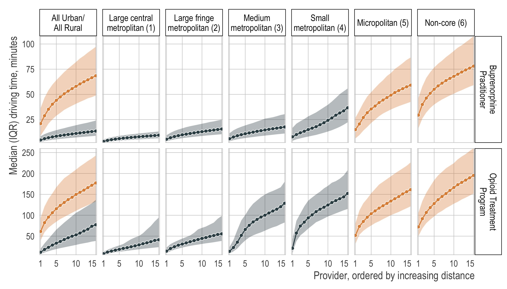

<!-- README.md is generated from README.Rmd. Please edit that file -->

# Fragility of estimated access to opioid treatment providers in rural vs. urban areas of the United States

## Introduction

Reproducible code for our paper, *[Fragility of estimated access to
opioid treatment providers in rural vs. urban areas of the United
States](TODO)*, which compares the impact of hypothetical changes in
physical access to opioid treatment across urban and rural counties. The
full citation is:

> Kiang MV, Barnett ML, Wakeman SE, Humphreys K, & Tsai AC, Fragility of
> estimated access to opioid treatment providers in rural vs urban areas
> of the United States. Forthcoming.

Please report any issues via email or [this
repo](https://github.com/mkiang/opioid_treatment_distance/issues).

## Structure

-   All data are publicly available. The raw data (i.e., directly from
    the source) is available in the **`./data_raw`** folder.
-   All necessary code is presented in the **`./code`** folder and
    designed to be run in sequential order. Note that the `90` and above
    files are sensitivity analyses and it is not necessary to run them
    to reproduce the primary plots or figures.
-   The scripts in the `./code` folder convert the data in the
    **`./data_raw`** folder into our analytic data which is stored in
    the `./data` folder.
-   The **`./intermediate_objects`** folder (not shared on Github)
    stores the temporary files. Specifically, we we calculate the
    distance between any census tract and the top 15 nearest providers
    by state, save each state’s result independently, and merge results.
    (Note that the nearest provider can still be across state boundaries
    so the `OSRM` server should have the entire US road network — see
    below for details.)
-   The **`./output`** folder contains all output (i.e., plots, tables,
    etc) relevant to the paper.
-   The **`./rmds`** folder contains the supplemental information such
    as session information (such as package version numbers) required to
    reproduce the analysis.

## Preparation

Note that reproducing all figures and tables can be done by running the
`08` to `10` code files. However, in order to rerun the entire pipeline
start to finish (e.g., on new data), there are several additional
requirements.

-   **OSRM Server.** In order to calculate the driving times, we use
    [OpenStreetMap-Based Routing Service
    OSRM](https://github.com/rCarto/osrm). This will require you to set
    up an OSRM server on your computer. Instructions differ but we
    describe the process we used in the `./rmds/install_osrm.html` file.
    The server and its relevant files should be stored and run in the
    `./data_raw/osrm/` folder or changed appropriately. (Warning: This
    is a memory intensive process and 64 GB of ram is recommended.)
-   **Google Maps API credentials**. See, for example, [this page on how
    to obtain Google Map
    credentials](https://cran.r-project.org/web/packages/ggmap/readme/README.html)
    for converting messy street addresses to latitude/longitude.
    (**WARNING**: Google Map API pings cost money after \~40,000 queries
    per month.)
-   **US Census Bureau API credentials**. Go to the
    [Census.gov](https://api.census.gov/data/key_signup.html) website to
    get your own API keys to access the ACS population data. This is
    only necessary if you want to pull different population estimates
    than what was used in the paper.
-   **Credential file (`secrets.R`)**. Both the Google Maps and USCB
    credentials should be stored in a file called `./code/secrets.R`.
    See the `./code/secrets_example.R` file.
-   **Decompressing the shapefiles**. The shapefiles for census tracts
    of every state are stored in the `./data_raw/shp_files`. These `zip`
    files need to be decompressed.

## Authors (alphabetical)

-   [Michael Barnett](https://www.hsph.harvard.edu/michael-barnett/)
    (:
    [@ml\_barnett](https://twitter.com/ml_barnett))
-   [Keith Humphreys](https://profiles.stanford.edu/keith-humphreys)
    (:
    [@KeithNHumphreys](https://twitter.com/KeithNHumphreys))
-   [Mathew Kiang](https://mathewkiang.com)
    (:
    [mkiang](https://github.com/mkiang) \|
    :
    [@mathewkiang](https://twitter.com/mathewkiang))
-   [Alexander
    Tsai](https://connects.catalyst.harvard.edu/Profiles/display/Person/90553)
    (:
    [@drdrtsai](https://twitter.com/drdrtsai))
-   [Sarah
    Wakeman](https://connects.catalyst.harvard.edu/Profiles/display/Person/15975)
    (:
    [@DrSarahWakeman](https://twitter.com/DrSarahWakeman))

## Reproducible information

See the `./rmds/session_info.html` file for full reproducible
information including package version numbers.
